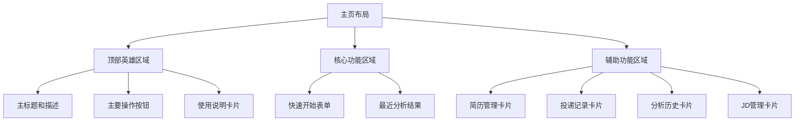

# 现代布局方案

## 页面结构设计原则

### 1. 视觉层次原则
- **F型阅读模式**：重要内容放在左上角
- **对比原则**：使用大小、颜色、间距创造视觉对比
- **对齐原则**：所有元素严格对齐网格
- **亲密性原则**：相关元素靠近，不相关元素分开

### 2. 响应式设计原则
- **移动优先**：从小屏幕开始设计
- **流体布局**：使用百分比和相对单位
- **断点优化**：在关键宽度优化布局

### 3. 用户体验原则
- **一致性**：相同功能使用相同样式
- **反馈**：所有操作都有视觉或交互反馈
- **效率**：减少点击次数，优化工作流

## 主页布局改进方案

### 当前布局问题
1. 顶部区域比例不协调
2. 底部卡片布局拥挤
3. 缺乏视觉焦点
4. 响应式表现不佳

### 改进后布局



### 具体实现

#### 1. 顶部英雄区域 (65%/35%布局)
```jsx
<section className="hero-section">
  {/* 左侧主区域 - 65% */}
  <div className="hero-main">
    <h1 className="hero-title">先解决这次投递要写什么</h1>
    <p className="hero-description">
      如果你已经确定好要投哪个岗位，现在只需要输入JD并选择一份简历，
      系统就会快速生成更贴合岗位的介绍、附言和简历修改建议。
    </p>
    <button className="btn-primary btn-lg">快速开始一次投递</button>
  </div>
  
  {/* 右侧说明区域 - 35% */}
  <aside className="hero-sidebar">
    <h3 className="sidebar-title">使用说明</h3>
    <ol className="sidebar-steps">
      <li>点击"快速开始一次投递"</li>
      <li>选择简历并粘贴目标岗位JD</li>
      <li>系统自动生成自我介绍和修改建议</li>
      <li>投递后记录状态和反馈</li>
    </ol>
  </aside>
</section>

/* 样式定义 */
.hero-section {
  @apply grid lg:grid-cols-[65%_35%] gap-8 items-stretch;
}

.hero-main {
  @apply rounded-3xl bg-white p-8 shadow-xl;
}

.hero-sidebar {
  @apply rounded-3xl bg-slate-900 text-white p-8 shadow-xl;
}
```

#### 2. 核心功能区域 (垂直布局)
```jsx
<section className="core-section">
  <div className="section-header">
    <h2 className="section-title">开始一次投递准备</h2>
    <p className="section-description">
      你现在只需要做两件事：粘贴目标岗位JD，选择一份基础简历。
      系统会自动完成岗位解析和匹配分析。
    </p>
  </div>
  
  <div className="core-content">
    {/* 表单区域 */}
    <form className="core-form">
      {/* 表单字段 */}
    </form>
    
    {/* 结果区域 */}
    <div className="core-results">
      {/* 分析结果 */}
    </div>
  </div>
</section>

/* 样式定义 */
.core-section {
  @apply rounded-3xl bg-white/90 p-8 shadow-lg backdrop-blur-sm;
}

.core-content {
  @apply mt-8 space-y-8;
}
```

#### 3. 辅助功能区域 (网格布局)
```jsx
<section className="tools-section">
  <div className="section-header">
    <h2 className="section-title">辅助入口</h2>
    <p className="section-description">按需进入其他功能</p>
  </div>
  
  <div className="tools-grid">
    {tools.map(tool => (
      <div key={tool.id} className="tool-card">
        <h3 className="tool-title">{tool.title}</h3>
        <p className="tool-description">{tool.description}</p>
        <button className="btn-secondary">进入</button>
      </div>
    ))}
  </div>
</section>

/* 样式定义 */
.tools-grid {
  @apply grid grid-cols-1 md:grid-cols-2 lg:grid-cols-4 gap-6;
}

.tool-card {
  @apply rounded-2xl bg-white p-6 border border-slate-200
         shadow-md hover:shadow-lg transition-shadow duration-300
         flex flex-col;
}
```

## 响应式布局策略

### 移动端 (< 640px)
```css
/* 单列布局 */
.hero-section {
  grid-template-columns: 1fr;
}

.tools-grid {
  grid-template-columns: 1fr;
}

/* 减小内边距 */
.hero-main, .hero-sidebar {
  padding: 1.5rem;
}

/* 调整字体大小 */
.hero-title {
  font-size: 1.875rem; /* text-3xl */
}
```

### 平板端 (640px - 1024px)
```css
/* 两列布局 */
.tools-grid {
  grid-template-columns: repeat(2, 1fr);
}

/* 调整间距 */
.hero-section {
  gap: 1.5rem;
}
```

### 桌面端 (> 1024px)
```css
/* 完整布局 */
.hero-section {
  grid-template-columns: 65% 35%;
}

.tools-grid {
  grid-template-columns: repeat(4, 1fr);
}

/* 增加内边距 */
.hero-main, .hero-sidebar {
  padding: 2rem;
}
```

## 页面间一致性设计

### 1. 通用页面模板
```jsx
<main className="page-template">
  {/* 页面头部 */}
  <header className="page-header">
    <div>
      <p className="page-subtitle">{subtitle}</p>
      <h1 className="page-title">{title}</h1>
      <p className="page-description">{description}</p>
    </div>
    <div className="page-actions">
      {/* 操作按钮 */}
    </div>
  </header>
  
  {/* 内容区域 */}
  <div className="page-content">
    {/* 页面特定内容 */}
  </div>
  
  {/* 页脚区域 */}
  <footer className="page-footer">
    {/* 辅助信息 */}
  </footer>
</main>

/* 样式定义 */
.page-template {
  @apply min-h-screen bg-gradient-to-b from-slate-50 to-white
         px-4 py-8 sm:px-6 lg:px-8;
}

.page-header {
  @apply mb-8 rounded-3xl bg-white p-8 shadow-lg;
}

.page-content {
  @apply space-y-8;
}
```

### 2. 卡片列表布局
```jsx
<div className="card-list">
  {items.map(item => (
    <article key={item.id} className="card-list-item">
      <div className="card-header">
        <h3 className="card-title">{item.title}</h3>
        <span className="card-badge">{item.status}</span>
      </div>
      <div className="card-content">
        <p className="card-description">{item.description}</p>
      </div>
      <div className="card-actions">
        <button className="btn-secondary">查看</button>
        <button className="btn-text">编辑</button>
      </div>
    </article>
  ))}
</div>

/* 样式定义 */
.card-list {
  @apply grid grid-cols-1 md:grid-cols-2 lg:grid-cols-3 gap-6;
}

.card-list-item {
  @apply rounded-2xl bg-white p-6 border border-slate-200
         shadow-md hover:shadow-lg transition-all duration-300;
}
```

## 视觉改进效果

### 改进前 vs 改进后对比

| 方面 | 改进前 | 改进后 |
|------|--------|--------|
| **色彩系统** | 不协调的米色、黑色、白色混合 | 统一的品牌色系，层次分明 |
| **视觉层次** | 混乱的圆角、阴影、边框 | 统一的视觉系统，清晰的层次 |
| **按钮设计** | 单调的白底黑字按钮 | 多层次的按钮系统，品牌色引导 |
| **布局结构** | 拥挤的网格，缺乏焦点 | 清晰的视觉流，重点突出 |
| **响应式** | 基础响应，体验不佳 | 移动优先，优化各断点 |
| **交互反馈** | 简单的悬停效果 | 丰富的微交互和动画 |

### 预期用户体验提升

1. **首次印象**：更专业、现代的外观，提升用户信任度
2. **导航效率**：清晰的视觉层次，减少认知负荷
3. **操作流畅**：一致的交互模式，降低学习成本
4. **多设备体验**：优化的响应式设计，全设备友好
5. **情感连接**：愉悦的视觉和交互，提升用户满意度

## 实施路线图

### 阶段1：基础框架 (1周)
1. 更新全局样式 (`globals.css`)
2. 创建基础组件 (`Button`, `Card`, `Input`)
3. 更新主页布局
4. 建立设计令牌系统

### 阶段2：主要页面 (2周)
1. 更新 `/apply` 页面
2. 更新 `/applications` 页面
3. 更新 `/resume`, `/analysis`, `/jd` 页面
4. 优化表单和列表组件

### 阶段3：细节优化 (1周)
1. 添加微交互和动画
2. 优化性能
3. 测试可访问性
4. 收集用户反馈并迭代

### 阶段4：扩展功能 (持续)
1. 深色模式支持
2. 主题定制
3. 高级交互功能
4. 数据分析仪表板

## 成功度量指标

### 定量指标
1. 页面加载时间减少
2. 用户停留时间增加
3. 关键操作完成率提升
4. 错误率降低

### 定性指标
1. 用户满意度调查评分
2. 用户反馈中正面评价增加
3. 设计一致性评分
4. 可访问性合规性

## 风险与缓解

### 技术风险
- **CSS冲突**：使用CSS模块或作用域样式
- **性能影响**：优化CSS，减少重绘
- **浏览器兼容性**：使用现代CSS特性并提供降级

### 用户体验风险
- **用户不适应**：渐进式更新，保留核心交互
- **学习曲线**：保持一致性，减少变化
- **功能缺失**：确保所有功能在更新后可用

### 项目风险
- **时间超支**：分阶段实施，优先核心功能
- **资源不足**：使用现有Tailwind工具类，减少自定义开发
- **需求变更**：保持设计系统灵活性